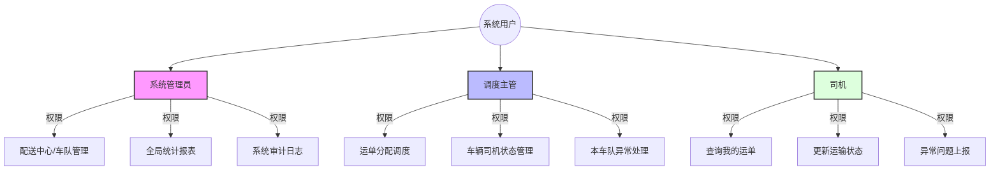
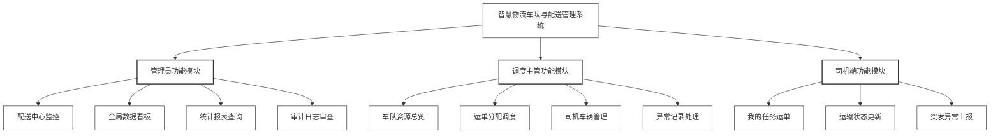
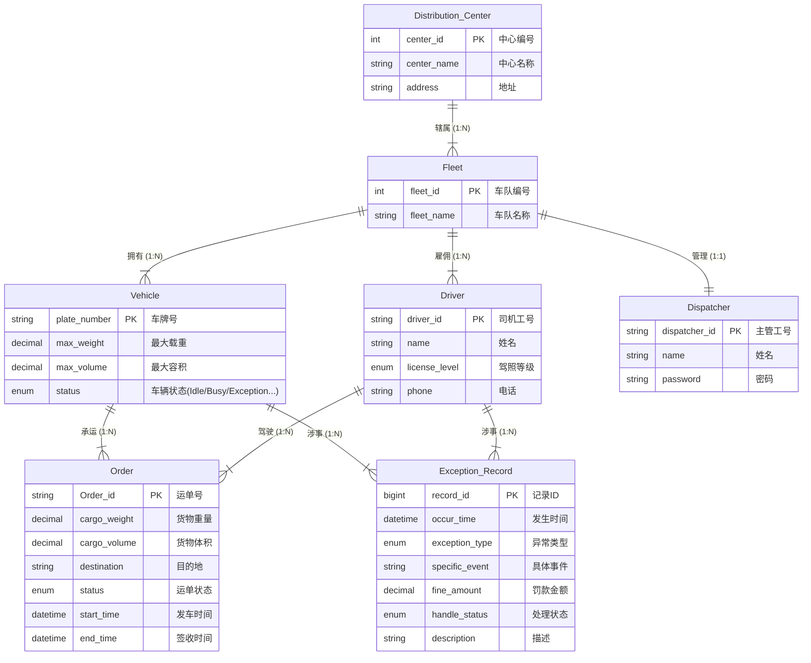
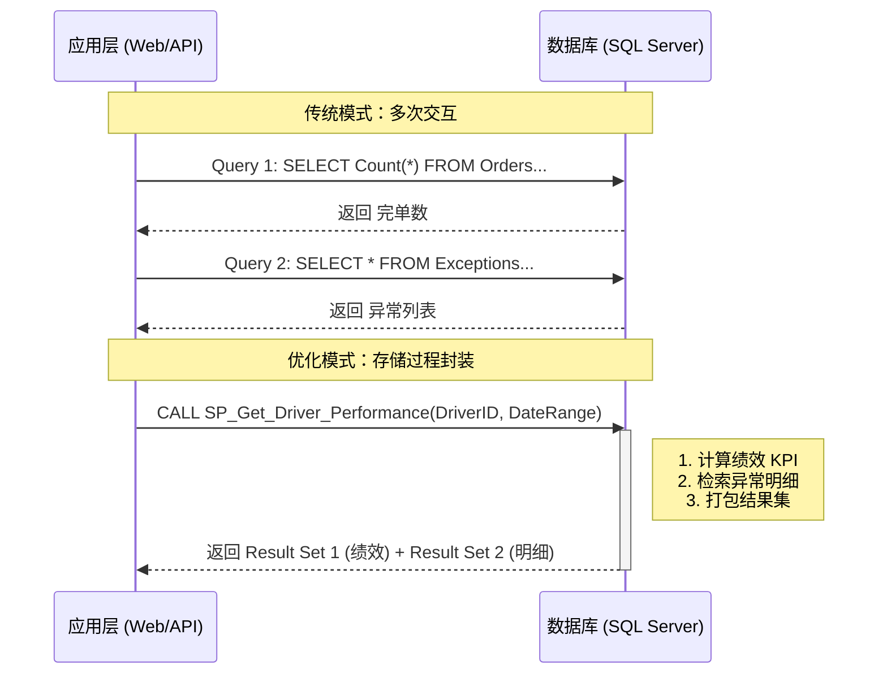
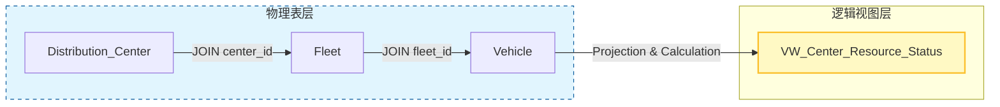
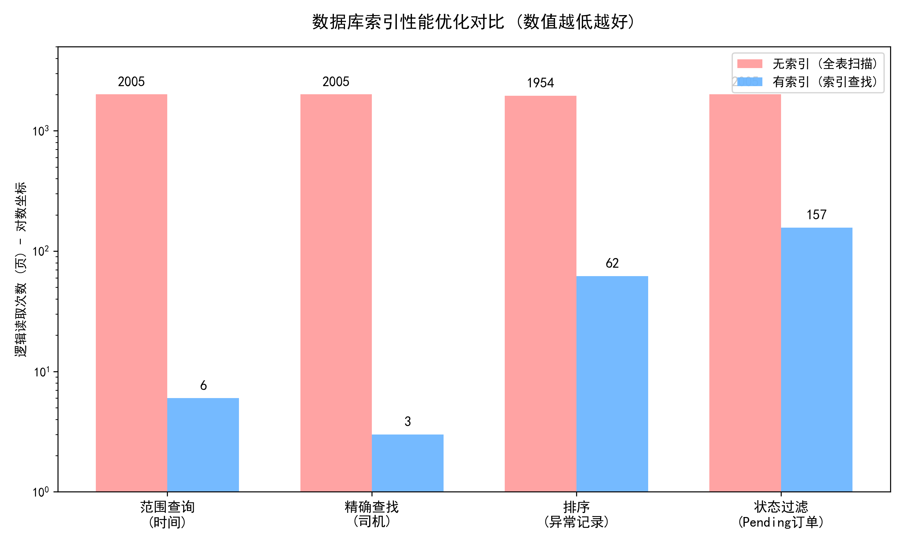
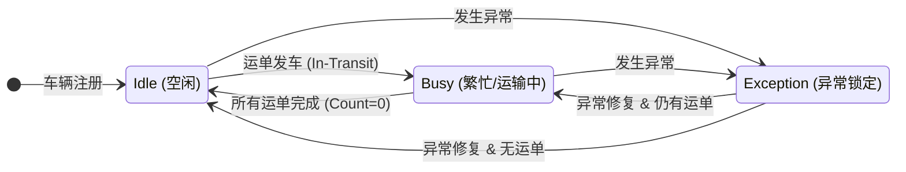
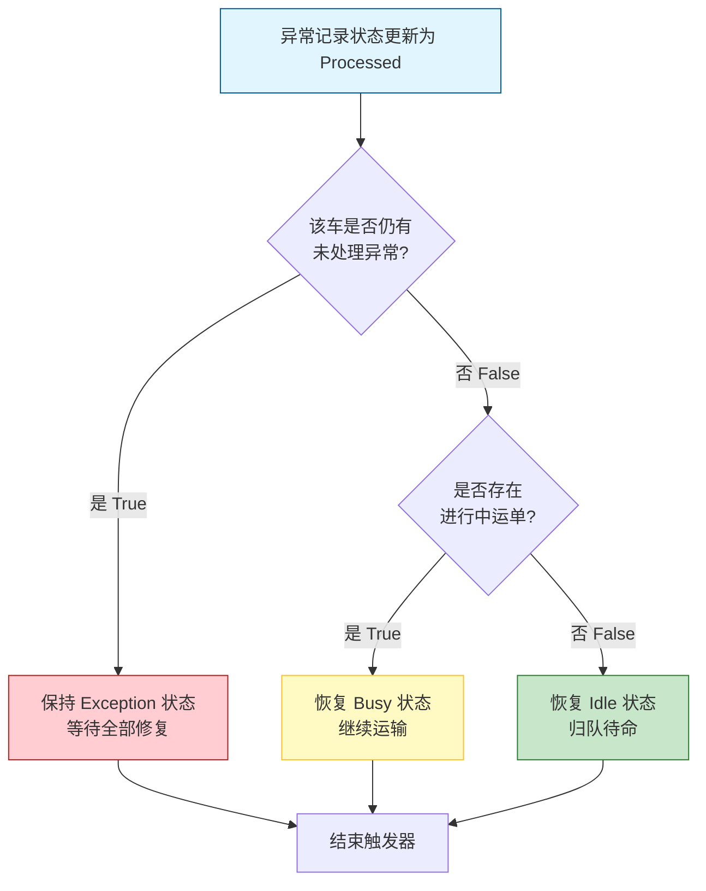

# 智慧物流车队与配送管理系统 - 数据库设计报告

## 0. 成员

| 学号 | 姓名 | 分工 | 贡献百分比 |
| :--- | :--- | :--- | :--- |
| 23320104 | 刘天翔 | 数据库设计、后端逻辑 | 33% |
| ... | ... | ... | 33% |
| ... | ... | ... | 33% |

---

## 0.5 系统架构

### 用户组织架构图



### 系统功能模块图



---

## 1. 概念结构设计

### 1.1 实体集 (Entity Sets)

根据需求分析，本系统包含以下关键实体：

1.  **配送中心 (Distribution_Center)**
    *   **描述**：物流网络的物理节点，负责管辖车队。
    *   **属性**：
        *   `center_id` (中心编号): 唯一标识 [PK]
        *   `center_name` (中心名称): 如“华东一号仓”
        *   `address` (地址): 物理位置
2.  **车队 (Fleet)**
    *   **描述**：车辆和人员的管理单元。
    *   **属性**：
        *   `fleet_id` (车队编号): 唯一标识 [PK]
        *   `fleet_name` (车队名称): 如“干线车队”
3.  **车辆 (Vehicle)**
    *   **描述**：运输工具。
    *   **属性**：
        *   `plate_number` (车牌号): 唯一标识 [PK]
        *   `max_weight` (最大载重): 吨
        *   `max_volume` (最大容积): 立方米
        *   `status` (车辆状态): 枚举值 (Idle, Loading, Busy, Maintenance, Exception)
4.  **司机 (Driver)**
    *   **描述**：车辆驾驶员。
    *   **属性**：
        *   `driver_id` (工号): 唯一标识 [PK]
        *   `name` (姓名)
        *   `license_level` (驾照等级): A1, A2, B1等
        *   `phone` (联系电话)
5.  **调度主管 (Dispatcher)**
    *   **描述**：车队负责人，拥有系统登录权限。
    *   **属性**：
        *   `dispatcher_id` (工号/账号): 唯一标识 [PK]
        *   `name` (姓名)
        *   `password` (登录密码): 用于系统认证
6.  **运单 (Order)**
    *   **描述**：物流运输任务单据。
    *   **属性**：
        *   `Order_id` (运单号): 唯一标识 [PK]
        *   `cargo_weight` (货物重量)
        *   `cargo_volume` (货物体积)
        *   `destination` (目的地)
        *   `status` (运单状态): Pending, Loading, In-Transit, Delivered
        *   `start_time` (发车时间)
        *   `end_time` (签收时间)
7.  **异常记录 (Exception_Record)**
    *   **描述**：运输、日常中的意外事件。
    *   **属性**：
        *   `record_id` (记录ID): 唯一标识 [PK]
        *   `occur_time` (发生时间)
        *   `exception_type` (异常类型): 核心枚举值 (Transit_Exception-运输中异常, Idle_Exception-空闲时异常) —— 决定车辆恢复状态
        *   `specific_event` (具体事件): 如货物破损、车辆故障、严重延误、超速报警等
        *   `fine_amount` (罚款金额)
        *   `handle_status` (处理状态): Unprocessed, Processed
        *   `description` (描述)

8.  **审计日志 (History_Log)**
    *   **描述**：记录关键数据变更的历史信息（系统辅助实体）。
    *   **属性**：
        *   `log_id` (日志ID): 唯一标识 [PK]
        *   `table_name` (来源表名)
        *   `record_key` (记录主键)
        *   `column_name` (变更字段)
        *   `old_value` (旧值)
        *   `new_value` (新值)
        *   `change_time` (变更时间)
        *   `operator` (操作人)

### 1.2 关系集 (Relationship Sets)

1.  **辖属 (Center-Fleet)**: 1个配送中心下辖 N 个车队 (1:N)
2.  **拥有 (Fleet-Vehicle)**: 1个车队拥有 N 辆车 (1:N)
3.  **属于 (Fleet-Driver)**: 1个车队雇佣 N 名司机 (1:N)
4.  **管理 (Fleet-Dispatcher)**: 1个车队由 1 名主管管理 (1:1)
5.  **运输 (Vehicle-Order)**: 1辆车可以承运 N 个运单 (1:N)
6.  **驾驶 (Driver-Order)**: 1名司机负责 N 个运单 (1:N)
7.  **涉事车辆 (Exception-Vehicle)**: N 条异常关联 1 辆车 (N:1)
8.  **涉事司机 (Exception-Driver)**: N 条异常关联 1 名司机 (N:1)

### 1.3 E-R 图



## 1.4 用户角色与权限

系统设计了三类用户角色：


---

## 2. 逻辑结构设计

### 2.1 关系模式 (Relational Schemas)

将上述 E-R 图转换为关系模式，下划线表示主键，斜体表示外键。

1.  **Distribution_Center** (<u>center_id</u>, center_name, address)
2.  **Fleet** (<u>fleet_id</u>, fleet_name, *center_id*)
3.  **Dispatcher** (<u>dispatcher_id</u>, name, password, *fleet_id*)
4.  **Vehicle** (<u>plate_number</u>, *fleet_id*, max_weight, max_volume, status)
5.  **Driver** (<u>driver_id</u>, name, license_level, phone, *fleet_id*)
6.  **Order** (<u>Order_id</u>, cargo_weight, cargo_volume, destination, status, *vehicle_plate*, *driver_id*, start_time, end_time)
7.  **Exception_Record** (<u>record_id</u>, *vehicle_plate*, *driver_id*, occur_time, exception_type, specific_event, fine_amount, handle_status, description)
8.  **History_Log** (<u>log_id</u>, table_name, record_key, column_name, old_value, new_value, change_time, operator)

### 2.2 规范化分析

我们将证明上述关系模式至少满足 3NF（甚至 BCNF）。

$$
F = \{ 
\text{plate\_number} \to \text{fleet\_id}, \quad
\text{plate\_number} \to \text{max\_weight}, \quad
\text{plate\_number} \to \text{max\_volume}, \quad
\text{plate\_number} \to \text{status}, \\
 \}
$$

**分析示例：Vehicle 表**
*   **函数依赖集 F**: { `plate_number` -> `fleet_id`, `plate_number` -> `max_weight`, `plate_number` -> `max_volume`, `plate_number` -> `status` }
*   **分析**: 唯一的候选键是 `plate_number`。F 中所有函数依赖的左部都是候选键。不存在非主属性对码的传递依赖。因此满足 BCNF。

**分析示例：Fleet 表**
*   **函数依赖集 F**: { `fleet_id` -> `fleet_name`, `fleet_id` -> `center_id` }
*   **分析**: 主键 `fleet_id` 决定所有属性，无传递依赖。满足 BCNF。

**结论**: 所有设计的表结构主键明确，非主属性完全依赖于主键，且不存在传递依赖，符合 3NF 设计规范，消除了数据冗余和更新异常。

---

## 3. 物理结构与高级对象设计

### 3.1 表结构定义 (Table Definitions)

采用 MySQL/PostgreSQL 语法进行定义（简略展示）。

*(此处请填入具体的 CREATE TABLE 语句，参考 condition.txt 文档要求和数据库框架.md)*

### 3.2 触发器设计 (Triggers)

为了实现业务自动化和数据完整性，系统设计了以下 6 个核心触发器：

1.  **TRG_Load_Check (安全校验)**
    *   **时机**: `Order` 插入/更新前。
    *   **逻辑**: 校验车辆剩余载重和容积是否足够（累加该车所有 Status 为 Loading/In-Transit 的运单）。若超载，抛出错误拦截操作。同时校验司机与车辆是否属于同一车队。
2.  **TRG_Auto_Status_Update (状态流转)**
    *   **时机**: `Order` 更新后。
    *   **逻辑**: 当运单状态变为 Delivered，检查车辆是否不再有正在进行的运单。若是，自动将车辆状态置为 Idle。
3.  **TRG_Exception_Flag (异常标记)**
    *   **时机**: `Exception_Record` 插入后。
    *   **逻辑**: 一旦录入异常，立即将关联车辆状态锁定为 Exception。
4.  **TRG_Exception_Recovery (智能恢复)**
    *   **时机**: `Exception_Record` 更新后（当 handled_status 变为 Processed）。
    *   **逻辑**: 检查车辆所有异常是否都已处理。若已全部处理，判断当前是否有未完成运单：有则恢复为 Busy，无则恢复为 Idle。
5.  **TRG_Exception_Audit (异常审计)**
    *   **时机**: `Exception_Record` 更新后。
    *   **逻辑**: 当处理状态变更时，向 History_Log 插入审计记录。
6.  **TRG_Driver_Update_Audit (司机信息审计)**
    *   **时机**: `Driver` 更新前。
    *   **逻辑**: 监控驾照等级等关键信息变更，记录旧值到 History_Log。

### 3.3 核心业务逻辑封装：存储过程 (Stored Procedures)

为了提高系统性能并保证业务逻辑的一致性，本项目将复杂的聚合计算与多步骤查询封装为存储过程。这种设计有效减少了应用层与数据库之间的网络交互（Round-trips），并将统计口径严格收敛于数据库层。

#### 3.3.1 车队月度运营报表 (`SP_Calc_Fleet_Monthly_Report`)

**功能描述：**
该过程用于生成指定车队的月度运营概览，支持管理层进行财务结算与绩效评估。

**实现逻辑与技术细节：**
1.  **时间边界处理：**
    输入参数仅需年份与月份信息。内部利用 `DATEFROMPARTS` 构造当月首日，配合 `DATEADD` 计算下月首日，构建 `[Start, End)` 的**左闭右开**时间区间。相比传统的 `BETWEEN` 语法，该方法能精确处理时间部分（Time Component），避免因毫秒精度导致的跨月统计误差。
2.  **多维聚合计算：**
    过程内部并行执行三个子查询，分别统计：
    * **运单量：** 基于 `start_time` 统计该车队车辆承运的任务总数。
    * **异常频次：** 统计关联车辆发生的 `Exception_Record` 数量。
    * **罚款总额：** 聚合计算 `fine_amount`，对于 `NULL` 值使用 `ISNULL(..., 0)` 进行清洗，防止计算溢出。

**优势分析：**
通过一次调用即可返回涵盖运营、合规、财务三个维度的汇总数据，避免了前端多次发起 SQL 请求造成的延迟。

#### 3.3.2 司机绩效与异常透视 (`SP_Get_Driver_Performance`)

**功能描述：**
为“司机详情页”提供数据支撑，一次性返回司机的核心KPI指标及详细的违规记录。

**实现逻辑与技术细节：**
本过程采用了**多结果集（Multiple Result Sets）**返回模式：
1.  **结果集一（KPI 概览）：** 返回司机基本信息及其在指定时间段内状态为 `Delivered` 的完单总数，作为绩效考核基准。
2.  **结果集二（异常明细）：** 返回该司机的时间轴倒序异常记录（包含类型、罚款及处理状态）。

**设计图解：**
下面的时序图展示了该存储过程如何将应用层的多次逻辑合并为一次数据库交互。


### 3.4 数据抽象与展示优化：视图 (Views)

视图层作为物理表与应用层之间的缓冲接口，用于固化高频的联表查询逻辑（Joins）并简化数据结构，使前端开发无需关注底层复杂的实体关系（ER）模型。

#### 3.4.1 实时异常预警看板 (`VW_Weekly_Alert`)

**设计目的：**
服务于系统首页的“监控仪表盘”，提供最近 7 天内的实时异常数据流。

**逻辑实现：**
* **时间窗口：** 使用 `DATEADD(DAY, -7, GETDATE())` 动态过滤数据，确保看板仅展示即时高优问题，避免历史数据干扰视线。
* **容错连接：** 采用 `LEFT JOIN` 关联 `Vehicle`、`Driver` 和 `Fleet` 表。即使某些异常记录关联的车辆或司机已被归档（物理删除），视图仍能保留异常记录本身（Record ID、Type、Event），保证审计数据的完整性。

#### 3.4.2 配送中心资源全景图 (`VW_Center_Resource_Status`)

**设计目的：**
为区域调度员提供跨层级的资源视图，解决“从配送中心（Center）查到具体车辆（Vehicle）”需要跨越三层表关联的痛点。

**逻辑实现：**
1.  **层级扁平化：** 将 `Distribution_Center` -> `Fleet` -> `Vehicle` 的三层层级结构展平为一张宽表。
2.  **计算列（Computed Column）：**
    引入衍生字段 `availability`。逻辑如下：
    $$Availability = \begin{cases} \text{'Available'} & \text{if } Status = \text{'Idle'} \\ \text{'Unavailable'} & \text{if } Status \in \{\text{'Busy'}, \text{'Exception'}, \text{'Maintenance'}\} \end{cases}$$
    这一转换将数据库底层的技术状态码直接转化为业务可读的“可用性”标签，简化了前端的逻辑判断。

**数据血缘图解：**
该视图将分散的物理表聚合为统一的逻辑视图，如下图所示：


### 3.5 索引策略 (Indexes)


#### 3.5.1 策略制定原则
在本系统的数据库物理设计阶段，索引策略的制定并未盲目追求数量，而是基于**工作负载分析 (Workload Analysis)** 和 **读写平衡 (Read/Write Trade-off)** 原则。考虑到物流配送系统具有“高并发读（车辆调度、状态查询）”和“周期性写（运单生成、位置更新）”的 OLTP（在线事务处理）特性，我们制定了以下核心策略：

1.  **覆盖高频查询路径**：针对 `WHERE` 子句、`JOIN` 连接列以及 `ORDER BY` 排序字段建立索引。
2.  **利用覆盖索引 (Covering Index)**：通过 `INCLUDE` 包含非键列，消除回表操作 (Key Lookup/Bookmark Lookup)，降低 I/O 开销。
3.  **外键索引全覆盖**：SQL Server 不会自动为外键创建索引，必须手动建立以避免级联删除/更新时的全表锁，并优化连接性能。

#### 3.5.2 详细索引设计与深度优化思路

##### 3.5.2.1 车辆资源调度优化 (Vehicle Resource Optimization)
* **索引名称**：`IDX_Vehicle_Status`
* **目标表**：`Vehicle`
* **定义**：`ON Vehicle(status) INCLUDE (max_weight, max_volume)`
* **深度优化逻辑**：
    * **场景痛点**：调度算法的核心逻辑是 `SELECT max_weight, max_volume FROM Vehicle WHERE status = 'Idle'`。若无索引，数据库引擎必须执行**全表扫描 (Clustered Index Scan)**，时间复杂度为 $O(N)$。
    * **解决方案**：建立非聚集索引。由于 `status` 列的**基数 (Cardinality)** 较小（只有 4 种状态），通常选择性不高。但通过将 `status` 作为索引键，并将业务所需的 `max_weight` 和 `max_volume` 作为**包含列 (Included Columns)**，我们构建了一个**覆盖索引**。
    * **性能收益**：查询引擎无需访问主表的数据页（Heap 或 Clustered Index），直接在非聚集索引的叶子节点即可获取所有所需数据。这消除了昂贵的随机 I/O 操作，将查询成本降至最低。

##### 3.5.2.2 时间维度报表优化 (Temporal Reporting Optimization)
* **索引名称**：`IDX_Order_Date`
* **目标表**：`[Order]`
* **定义**：`ON [Order](start_time, end_time)`
* **深度优化逻辑**：
    * **B-Tree 特性利用**：B-Tree 索引是有序存储的。针对 `start_time` 建立索引，使得 `WHERE start_time BETWEEN '2023-01-01' AND '2023-01-31'` 这样的范围查询可以转化为高效的**索引范围扫描 (Index Range Scan)**。
    * **组合索引顺序**：我们将 `start_time` 放在首位，因为报表通常以发车时间作为筛选基准。`end_time` 作为第二键值，有助于计算运输时长（Duration）时的排序和筛选。

##### 3.5.2.3 外键与关联查询优化 (Foreign Key & Join Optimization)
* **索引名称**：`IDX_Order_Vehicle` / `IDX_Exception_Driver`
* **目标表**：`[Order]`, `Exception_Record`
* **定义**：针对所有外键列（如 `vehicle_plate`, `driver_id`）建立非聚集索引。
* **深度优化逻辑**：
    * **避免 Hash Join**：当 `Driver` 表（小表）与 `Exception_Record` 表（大表）连接时，如果外键列 `driver_id` 没有索引，优化器往往会选择 **Hash Join**，需要消耗大量内存构建哈希表。
    * **促进 Nested Loop Join**：建立索引后，优化器更倾向于使用 **Nested Loop Join**，利用索引快速查找匹配行，这对提取单条记录（如“查询司机王某的所有违规”）极其高效。
    * **聚合函数加速**：在 `[Order]` 表的 `vehicle_plate` 索引中，我们额外 `INCLUDE (cargo_weight)`。这样在触发器检查超载时执行 `SUM(cargo_weight)`，数据库只需扫描轻量级的索引页，而无需读取宽大的数据行。

#### 3.5.3 索引代价与维护 (Cost & Maintenance)

在享受查询加速的同时，我们也在设计中考量了索引带来的代价：

* **写操作惩罚 (Write Penalty)**：每当 `[Order]` 表插入新记录时，数据库不仅要写入数据页，还要更新 `IDX_Order_Date` 和 `IDX_Order_Vehicle` 的 B-Tree 结构。
* **存储空间**：非聚集索引需要额外的磁盘空间。为此，我们避免了 `SELECT *` 的滥用，仅在 `INCLUDE` 中包含必要的列，以控制索引叶子节点的大小。
* **碎片管理 (Fragmentation)**：由于 `Order_id` 是字符串且可能非顺序插入，易导致页分裂。我们在生产环境建议设置合理的 `FILLFACTOR` (如 90%) 以预留空间减少页分裂。

> 说明：`Dispatcher` 表的登录查询依赖主键 `dispatcher_id`，系统已自动为主键建立聚集索引，因此未额外增加重复索引以避免维护成本。

## 4. 系统实现与测试

### 4.1 开发环境
*   **Operating System**: Windows
*   **Database**: Microsoft SQL Server 2019 
*   **IDE**: SQL Server Management Studio (SSMS)
*   **编程语言**: Python 3.10
*   **Web Framework**: Django 4.2
*   **前端框架**: Bootstrap 5

### 4.2 关键功能展示
*(此处插入关键功能的运行截图)*
*   图1：超载触发器拦截报错截图。
*   图2：运单分配与车辆状态自动变更截图。
*   图3：异常录入与车辆锁定截图。


#### 4.2.n 索引性能验证与分析 (Index Performance Verification)

##### 4.2.n.1 测试环境与方法
为了客观验证索引策略的有效性，本次实验采用“控制变量法”进行性能对比测试。
* **测试数据量**：在 `[Order]` 表和 `Exception_Record` 表分别生成 **100,000 条** 模拟业务数据。
* **测试指标**：主要关注 **逻辑读取次数 (Logical Reads)**。该指标反映了数据库引擎从缓存或磁盘读取数据页的数量，是衡量查询 I/O 开销的核心指标，受系统负载波动影响较小，比“执行时间”更具参考价值。
* **测试工具**：使用 SQL Server 的 `SET STATISTICS IO ON` 和 `SET STATISTICS TIME ON` 捕获性能数据。

#### 4.2.n.2 详细性能对比分析

根据实验日志，针对四类典型高频查询场景的性能对比数据如下：

##### 1. 时间范围查询 (Range Scan Optimization)
* **业务场景**：查询过去 24 小时内的所有运单。
    ```sql
    SELECT ... FROM [Order] WHERE start_time >= DATEADD(DAY, -1, GETDATE()) ...
    ```
* **性能数据**：
    * **无索引**：逻辑读取 **2005** 页 。
    * **有索引** (`IDX_Order_Date`)：逻辑读取 **6** 页 。
* **分析**：
    性能提升幅度达到 **99.7%**。未建立索引时，数据库执行全表扫描 (Clustered Index Scan)，必须遍历 10 万行数据。建立 B-Tree 索引后，引擎通过索引范围扫描 (Index Range Scan) 直接定位到时间段的起始页，仅读取相关数据页，极大地降低了 I/O 成本。

##### 2. 多条件精确查找 (Multi-Column Lookup)
* **业务场景**：查询特定司机（DR001）在过去 24 小时已送达的运单。
    ```sql
    SELECT ... FROM [Order] WHERE driver_id = 'DR001' AND status = 'Delivered' ...
    ```
* **性能数据**：
    * **无索引**：逻辑读取 **2005** 页。
    * **有索引** (`IDX_Order_Driver` / 复合索引)：逻辑读取 **3** 页。
* **分析**：
    逻辑读取数从 2005 降至 **3**，这是最显著的优化案例。利用非聚集索引的高选择性，数据库避免了全表扫描，通过 Index Seek 瞬间定位到目标行，实现了毫秒级响应。

##### 3. 排序与过滤优化 (Sort & Filter Optimization)
* **业务场景**：查询某司机的异常记录并按时间倒序排列。
    ```sql
    SELECT ... FROM Exception_Record WHERE driver_id = 'DR001' ORDER BY occur_time DESC
    ```
* **性能数据**：
    ***无索引**：逻辑读取 **1954** 页，CPU 时间 **15 ms** 。
    ***有索引** (`IDX_Exception_Driver`)：逻辑读取 **62** 页，CPU 时间 **0 ms** 。
* **分析**：
    I/O 开销降低 **96.8%**，且 CPU 占用降至 0ms。无索引时，数据库需全表扫描并进行内存排序 (Sort Operator)。有索引后，数据本身在索引树中已按键值有序存储（或利用索引辅助排序），消除了昂贵的排序计算开销。

##### 4. 状态筛选优化 (Status Filtering)
* **业务场景**：查找所有“待处理 (Pending)”状态的运单。
    ```sql
    SELECT ... FROM [Order] WHERE status = 'Pending'
    ```
* **性能数据**：
    * **无索引**：逻辑读取 **2005** 页 。
    * **有索引** (`IDX_Order_Status`)：逻辑读取 **157** 页 。
* **分析**：
    读取次数降低约 **92%**。由于历史订单多为 "Delivered"，"Pending" 状态的数据占比较小。索引使得引擎可以跳过绝大多数历史数据，仅精准扫描活跃订单部分。

### 4.2.n.3 性能可视化

下图展示了各场景在优化前后逻辑读取次数（Logical Reads）的对比，Y轴采用对数坐标以突显数量级差异。



### 4.2.n.4 实验结论

1.  **I/O 吞吐量质变**：在高频的大表查询中，合理的索引策略将 I/O 读取量降低了 **2-3 个数量级**。这直接意味着生产环境下的磁盘负载将减少 90% 以上。
2.  **CPU 资源释放**：索引通过消除显式的排序操作（Sort）和大量的页扫描，大幅节省了 CPU 计算资源，这对提高系统的并发处理能力至关重要。
3.  **策略有效性**：实验证明，针对 `start_time`（范围）、`driver_id`（高频外键）和 `status`（状态流转）建立的索引策略是完全正确的，精准解决了高频查询路径上的性能瓶颈。


### 4.3 核心技术难点与解决方案：基于触发器的复杂业务逻辑实现

在车队管理系统（Fleet Distribution System）中，数据的一致性与业务规则的自动化执行是后端设计的核心挑战。本项目没有将所有逻辑寄托于应用层代码，而是通过设计高复杂度的数据库触发器（Triggers），在数据存储层实现了“运单分配安全校验”、“车辆状态自动流转”及“异常闭环恢复”三大核心机制。

以下详述本模块遇到的技术难点及具体解决策略。

#### 4.3.1 难点一：动态负载校验与并发一致性

**难点描述：**
车辆配载是一个动态累加的过程。在分配运单（INSERT）或修改货物信息（UPDATE）时，系统必须实时计算车辆当前的累计载重与体积。传统应用层校验存在“读写时间差”问题，即在并发环境下，两个调度员可能同时向同一辆车分配任务，导致读取到的剩余容量均满足条件，但写入后实际超载。此外，UPDATE操作涉及“扣减旧值、累加新值”的复杂逻辑，处理不当极易导致统计偏差。

**解决方案：基于事务原子性的实时聚合校验 (`TRG_Load_Check`)**
本方案利用 `AFTER INSERT, UPDATE` 触发器，在数据库事务内部强制执行校验逻辑，利用数据库锁机制确保并发安全。

1.  **动态聚合计算：**
    触发器不依赖车辆表的静态字段，而是实时扫描 `Order` 表中状态为 `Pending`、`Loading` 及 `In-Transit` 的所有活跃运单，通过 `SUM()` 函数计算当前总负载。
    $$CurrentWeight = \sum_{i \in ActiveOrders} Weight_i$$
    该逻辑确保了无论业务层如何操作，数据库底层的物理限制（最大载重/容积）永远不会被突破。

2.  **多维约束检查：**
    除了物理容量，触发器还集成了业务约束：
    * **状态约束：** 强制检查车辆状态，仅允许 `Idle`（空闲）状态接受新任务，直接阻断对 `Busy` 或 `Exception` 车辆的非法分配。
    * **归属约束：** 通过级联查询 `Vehicle` 和 `Driver` 表的 `fleet_id`，强制保证“车队一致性”，防止跨车队违规调度。

#### 4.3.2 难点二：多条件下的车辆状态机自动流转

**难点描述：**
车辆状态（Idle / Busy / Exception）的流转并非简单的线性关系，而是受控于多张运单的生命周期。
* **发车锁定：** 单个运单发车（In-Transit）即可锁定车辆为 Busy。
* **完单释放：** 单个运单送达（Delivered）并不意味着车辆空闲，因为该车可能仍装载着其他未完成的运单。如果逻辑简单处理为“完单即空闲”，将导致严重的状态错误。

**解决方案：基于引用计数的自动状态机 (`TRG_Auto_Status_Update`)**
我们设计了基于“活跃运单计数”的智能状态回写机制：

1.  **锁定逻辑（正向流转）：**
    当监测到 `Order` 表状态变更为 `In-Transit` 时，触发器直接将关联车辆状态置为 `Busy`。此处增加了 `WHERE v.status = 'Idle'` 的防御性判断，避免覆盖更高优先级的 `Exception` 状态。

2.  **释放逻辑（逆向流转）：**
    当运单状态变更为 `Delivered` 时，系统并不直接释放车辆，而是执行一次“全量活跃单检查”：
    * **Step 1:** 遍历 `inserted` 表中所有完单车辆。
    * **Step 2:** 查询该车辆名下是否仍存在状态为 `Pending/Loading/In-Transit` 的记录。
    * **Step 3:** 仅当活跃运单计数（Count）为 **0** 时，才将车辆状态回写为 `Idle`。
    
    该设计利用游标（Cursor）遍历批量更新的记录，确保了在批量确认收货场景下，每辆车的状态都能被独立且正确地计算。



#### 4.3.3 难点三：异常处理的闭环恢复逻辑

**难点描述：**
异常管理是物流系统中最复杂的边界情况。
1.  **发生异常：** 需立即中断业务，无论车辆当前是否由运单，都必须强制锁定。
2.  **恢复异常：** 当异常记录被置为 `Processed` 时，车辆状态的恢复具有极大的不确定性。车辆可能还有其他未处理的异常（多重故障），或者在修复后仍需继续完成未送达的运单（恢复 Busy），也可能直接回库（恢复 Idle）。

**解决方案：双重检测的智能恢复策略 (`TRG_Exception_Flag` & `TRG_Exception_Recovery`)**

1.  **即时熔断机制：**
    通过 `TRG_Exception_Flag`，一旦 `Exception_Record` 表有新记录插入，无条件将车辆状态更新为 `Exception`，形成业务熔断，防止受损车辆被继续调度。

2.  **条件恢复算法：**
    在 `TRG_Exception_Recovery` 中，实现了一套严密的决策树逻辑：
    * **第一层判空（Check Unprocessed）：** 查询该车是否仍有 `handle_status = 'Unprocessed'` 的记录。若有，维持 `Exception` 状态不变。
    * **第二层判任务（Check Active Orders）：** 若所有异常均已消除，进一步查询是否存在进行中运单。
        * 若 `ActiveOrders > 0`：车辆状态恢复为 `Busy`（继续送货）。
        * 若 `ActiveOrders == 0`：车辆状态恢复为 `Idle`（任务完成，归队）。
  


### 总结
通过上述六个核心触发器的设计，本项目成功将复杂的业务规则下沉至数据库层。这不仅减轻了应用层的代码耦合度，更利用数据库ACID特性，从根本上杜绝了超载、状态冲突和异常流程未闭环等逻辑漏洞，显著提升了系统的鲁棒性。
### 4.4 前端技术选型与关键代码

**技术选型与逻辑（以 `views.py` 为核心的“前端控制层”）**

1. **Django 视图层（MTV 结构中的 View）**  
   - **选择原因**：本系统属于管理后台类型，页面以“表单提交 + 列表展示 + 状态更新”为主，前端逻辑更适合由视图函数集中处理。  
   - **技术逻辑**：在 `views.py` 中完成权限校验、参数解析、数据库读写、错误处理与消息反馈；模板仅负责渲染数据与页面布局。  
   - **适配场景**：运单分配、异常处理、司机/车辆管理等都是典型的“读写混合 + 多角色权限”场景，集中在 View 层能保证业务一致性。

2. **会话与权限控制**  
   - **选择原因**：系统区分管理员、调度主管、司机多角色，必须防止越权访问。  
   - **技术逻辑**：在 `views.py` 中通过 `_ensure_admin/_ensure_dispatcher/_ensure_driver` 进行统一拦截，结合 `request.session.role` 控制访问路径。

3. **消息反馈与事务控制**  
   - **选择原因**：后台操作以创建/更新为主，必须保证操作反馈清晰，且在数据库事务内保证一致性。  
   - **技术逻辑**：使用 `messages.success/error` 统一提示；更新运单状态与分配使用 `transaction.atomic()` 避免半写入。

**关键代码示例（来自 `managersystem/views.py`）**

1. **角色鉴权与统一入口**  
   将权限控制前置，避免模板层判断混乱。

```python
def _ensure_dispatcher(request):
    if not request.user.is_authenticated:
        messages.info(request, "请先登录。")
        return redirect("dispatcher_login")
    role = request.session.get("role")
    if role == "dispatcher":
        return None
    if role == "driver":
        messages.error(request, "当前为司机身份，无法访问该页面。")
        return redirect("driver_center")
    return redirect("dispatcher_login")
```

2. **登录与会话写入**  
   登录成功后写入角色、车队与用户名，后续页面无需重复查询。

```python
def dispatcher_login(request):
    if request.method == "POST":
        dispatcher_id = request.POST.get("dispatcher_id", "").strip()
        password = request.POST.get("password", "").strip()
        user = authenticate(request, username=dispatcher_id, password=password, role="dispatcher")
        if user is not None:
            auth_login(request, user)
            dispatcher = Dispatcher.objects.get(dispatcher_id=dispatcher_id)
            request.session["role"] = "dispatcher"   # 写入角色
            request.session["fleet_id"] = dispatcher.fleet_id  # 绑定车队
            messages.success(request, "登录成功。")
            return redirect("dashboard")
        messages.error(request, "账号或密码错误。")
    return render(request, "managersystem/login_dispatcher.html")
```

3. **首页统计与视图数据准备**  
   在 View 层聚合统计数据，模板直接渲染。

```python
status_summary = {key: 0 for key in VEHICLE_STATUS_LABELS}
for row in vehicle_queryset.values("status").annotate(total=Count("status")):
    status_summary[row["status"]] = row["total"]  # 统计各状态车辆数量

stats = {
    "total_vehicles": sum(status_summary.values()),
    "total_drivers": driver_queryset.count(),
    "pending_orders": Order.objects.filter(status="Pending").count(),
    "unprocessed_exceptions": exception_queryset.filter(handle_status="Unprocessed").count(),
}
```

4. **运单分配与状态更新（事务控制）**  
   通过原子事务确保状态更新与时间写入一致。

```python
if action == "update_status":
    order_id = request.POST.get("order_id")
    new_status = request.POST.get("new_status")
    with transaction.atomic():
        order = Order.objects.get(order_id=order_id)
        order.status = new_status
        if new_status == "Delivered":
            order.end_time = timezone.now()  # 自动写入完成时间
        order.save()
    messages.success(request, f"运单 {order_id} 状态已更新。")
```

5. **异常管理：处理与创建**  
   统一入口处理“标记已处理”和“新增异常”，并给出明确提示。

```python
if action == "resolve":
    record = ExceptionRecord.objects.get(record_id=record_id)
    if record.handle_status == "Unprocessed":
        record.handle_status = "Processed"
        record.save()
        messages.success(request, f"异常记录 {record_id} 已处理。")

ExceptionRecord.objects.create(
    vehicle_plate_id=vehicle_plate,
    driver_id=driver_id,
    exception_type=exception_type,
    fine_amount=fine_amount or 0,
    handle_status="Unprocessed",
)
```

6. **报表查询：调用存储过程**  
   在 View 层直接调用数据库存储过程，保证统计口径统一。

```python
with connection.cursor() as cursor:
    cursor.execute("EXEC SP_Calc_Fleet_Monthly_Report %s, %s", [fleet_id, full_date])
    columns = [col[0] for col in cursor.description]
    fleet_report = [dict(zip(columns, row)) for row in cursor.fetchall()]
```
“前端控制层”以 `views.py` 为核心，通过会话角色、事务控制、统一消息反馈和存储过程调用，将页面展示、交互与业务规则保持一致，既保证了操作安全，也提升了维护效率。


## 5. 总结

本次课程设计完成了一个符合 3NF 标准的物流配送管理系统数据库。通过引入触发器实现了业务逻辑的数据库端自动化（如状态流转、超载校验），大大减轻了应用层的负担，保证了数据的强一致性。存储过程和视图的使用则提高了统计报表的查询效率。

### 5.2 数据库效率优化的思考与总结

本系统的性能优化并非只依赖索引，而是贯穿于“建模—结构设计—逻辑实现—查询组织”的全过程。优化思路的核心是：**减少冗余、降低 I/O、缩短路径、让查询有路可走**。具体体现在以下几个层面：

1. **结构层（Schema）优化：从源头减少无效数据与 I/O**  
   结构层首先坚持 3NF，将配送中心、车队、车辆、司机、运单、异常、审计等分表存储，避免在运单中重复写入司机/车队等信息导致更新异常；主键与外键统一规范，主键保证行定位与聚簇组织，外键让 JOIN 路径明确并利于优化器估算，同时用唯一约束保证一对一关系（如车队-主管）。字段类型按业务精确控制（ID 用 INT/BIGINT、重量/金额用 DECIMAL、时间用 DATETIME），配合 NOT NULL、DEFAULT、CHECK/枚举状态，减少无效值与页空间浪费，并避免在核心表中堆积大文本或派生字段，使后续索引与统计更高效。

2. **业务逻辑层（Triggers）优化：减少应用层重复计算**  
   业务逻辑层把校验与状态流转前置到触发器中，运单分配时仅统计车辆未完成运单的重量/体积，避免应用层多次查询与重复 I/O；运单完成后自动回写车辆状态，异常发生/处理触发状态变更与审计记录，形成闭环。触发器实现尽量采用集合运算与最小化扫描的写法，并区分 Insert/Update 场景避免重复累计；同时依托数据库事务与隔离级别保证并发一致性，使“超载校验、权限限制、状态恢复”在同一事务内完成，从而减少跨层调用与错误回滚成本。

3. **查询组织层（Procedures & Views）优化：固定高频统计路径**  
   查询组织层通过视图与存储过程固化高频统计路径。视图（如本周异常警报、资源汇总）把多表 JOIN 与筛选封装，前端仅需 SELECT 即可获得结果，避免重复拼装 SQL；存储过程集中计算月报与司机绩效，参数化执行减少计划重新编译并统一口径，同时减少应用层循环统计的 I/O。报表型查询统一由数据库侧完成聚合与排序，缩短网络传输并降低前端解析成本；当统计口径需要调整时只需改动视图/过程即可，全局一致性更强。

4. **索引层优化：为高频查询铺路**  
   索引层以业务高频与高选择性条件为核心：空闲车辆筛选、运单时间范围、司机异常追溯等建立索引，并按“等值在前、范围在后”的顺序设计复合键；对统计类查询加入 INCLUDE 列形成覆盖索引，减少回表与逻辑读。对于主键已覆盖的列不再重复建索引，避免维护成本；对低选择性或写入频繁字段谨慎建索引，以免影响插入/更新性能。索引效果通过 STATISTICS IO/TIME 对比验证，将原有全表扫描转为索引定位/范围扫描，并显著降低逻辑读取。

5. **数据生命周期与可扩展性考虑**  
   数据生命周期与扩展性方面，将审计日志、历史异常视作冷数据独立存放，避免拖慢核心业务表；对运单等增长最快的表预留按时间分区或归档策略，便于历史数据迁移与统计。前端分页与筛选减少一次性拉取，降低网络与数据库压力；运营期可设置定期清理或归档任务，控制热表体量。结合定期备份与索引维护（重建/更新统计），并监控慢查询与热点表，确保数据规模增长后仍能保持稳定性能与可维护性。

总结来看，本系统的性能优化是一套“从设计到落地”的综合策略：**规范化减少冗余、触发器保证一致性、视图/存储过程缩短查询路径、索引提升高频访问效率**。这种“结构 + 逻辑 + 查询 + 索引”的组合，确保在数据量增长时仍能保持稳定的响应与可维护性。

---

## 6. 附录

### 6.1 主要 SQL 脚本
*(附上建表、触发器、存储过程的完整 SQL 代码)*

### 6.2 演示视频链接
*(视频链接)*
