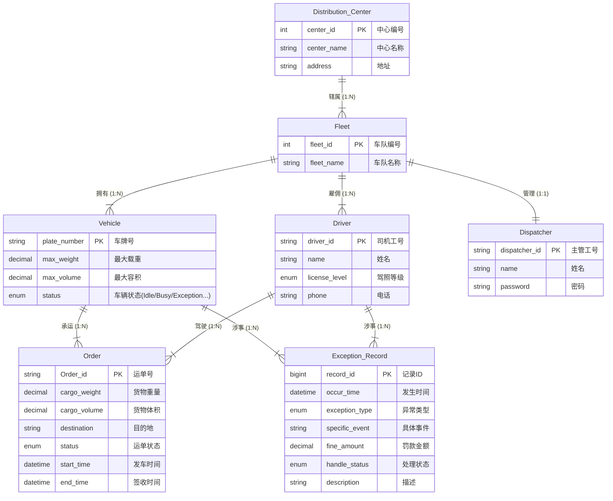

# 智慧物流车队与配送管理系统 - 数据库设计报告

## 0. 成员

| 学号 | 姓名 | 分工 | 贡献百分比 |
| :--- | :--- | :--- | :--- |
| 23320104 | 刘天翔 | 数据库设计、后端逻辑 | 33% |
| ... | ... | ... | 33% |
| ... | ... | ... | 33% |

---

## 1. 概念结构设计

### 1.1 实体集 (Entity Sets)

根据需求分析，本系统包含以下关键实体：

1.  **配送中心 (Distribution_Center)**
    *   **描述**：物流网络的物理节点，负责管辖车队。
    *   **属性**：
        *   `center_id` (中心编号): 唯一标识 [PK]
        *   `center_name` (中心名称): 如“华东一号仓”
        *   `address` (地址): 物理位置
2.  **车队 (Fleet)**
    *   **描述**：车辆和人员的管理单元。
    *   **属性**：
        *   `fleet_id` (车队编号): 唯一标识 [PK]
        *   `fleet_name` (车队名称): 如“干线车队”
3.  **车辆 (Vehicle)**
    *   **描述**：运输工具。
    *   **属性**：
        *   `plate_number` (车牌号): 唯一标识 [PK]
        *   `max_weight` (最大载重): 吨
        *   `max_volume` (最大容积): 立方米
        *   `status` (车辆状态): 枚举值 (Idle, Loading, Busy, Maintenance, Exception)
4.  **司机 (Driver)**
    *   **描述**：车辆驾驶员。
    *   **属性**：
        *   `driver_id` (工号): 唯一标识 [PK]
        *   `name` (姓名)
        *   `license_level` (驾照等级): A1, A2, B1等
        *   `phone` (联系电话)
5.  **调度主管 (Dispatcher)**
    *   **描述**：车队负责人，拥有系统登录权限。
    *   **属性**：
        *   `dispatcher_id` (工号/账号): 唯一标识 [PK]
        *   `name` (姓名)
        *   `password` (登录密码): 用于系统认证
6.  **运单 (Order)**
    *   **描述**：物流运输任务单据。
    *   **属性**：
        *   `Order_id` (运单号): 唯一标识 [PK]
        *   `cargo_weight` (货物重量)
        *   `cargo_volume` (货物体积)
        *   `destination` (目的地)
        *   `status` (运单状态): Pending, Loading, In-Transit, Delivered
        *   `start_time` (发车时间)
        *   `end_time` (签收时间)
7.  **异常记录 (Exception_Record)**
    *   **描述**：运输、日常中的意外事件。
    *   **属性**：
        *   `record_id` (记录ID): 唯一标识 [PK]
        *   `occur_time` (发生时间)
        *   `exception_type` (异常类型): 核心枚举值 (Transit_Exception-运输中异常, Idle_Exception-空闲时异常) —— 决定车辆恢复状态
        *   `specific_event` (具体事件): 如货物破损、车辆故障、严重延误、超速报警等
        *   `fine_amount` (罚款金额)
        *   `handle_status` (处理状态): Unprocessed, Processed
        *   `description` (描述)

8.  **审计日志 (History_Log)**
    *   **描述**：记录关键数据变更的历史信息（系统辅助实体）。
    *   **属性**：
        *   `log_id` (日志ID): 唯一标识 [PK]
        *   `table_name` (来源表名)
        *   `record_key` (记录主键)
        *   `column_name` (变更字段)
        *   `old_value` (旧值)
        *   `new_value` (新值)
        *   `change_time` (变更时间)
        *   `operator` (操作人)

### 1.2 关系集 (Relationship Sets)

1.  **辖属 (Center-Fleet)**: 1个配送中心下辖 N 个车队 (1:N)
2.  **拥有 (Fleet-Vehicle)**: 1个车队拥有 N 辆车 (1:N)
3.  **属于 (Fleet-Driver)**: 1个车队雇佣 N 名司机 (1:N)
4.  **管理 (Fleet-Dispatcher)**: 1个车队由 1 名主管管理 (1:1)
5.  **运输 (Vehicle-Order)**: 1辆车可以承运 N 个运单 (1:N)
6.  **驾驶 (Driver-Order)**: 1名司机负责 N 个运单 (1:N)
7.  **涉事车辆 (Exception-Vehicle)**: N 条异常关联 1 辆车 (N:1)
8.  **涉事司机 (Exception-Driver)**: N 条异常关联 1 名司机 (N:1)

### 1.3 E-R 图

---

## 2. 逻辑结构设计

### 2.1 关系模式 (Relational Schemas)

将上述 E-R 图转换为关系模式，下划线表示主键，斜体表示外键。

1.  **Distribution_Center** (<u>center_id</u>, center_name, address)
2.  **Fleet** (<u>fleet_id</u>, fleet_name, *center_id*)
3.  **Dispatcher** (<u>dispatcher_id</u>, name, password, *fleet_id*)
4.  **Vehicle** (<u>plate_number</u>, *fleet_id*, max_weight, max_volume, status)
5.  **Driver** (<u>driver_id</u>, name, license_level, phone, *fleet_id*)
6.  **Order** (<u>Order_id</u>, cargo_weight, cargo_volume, destination, status, *vehicle_plate*, *driver_id*, start_time, end_time)
7.  **Exception_Record** (<u>record_id</u>, *vehicle_plate*, *driver_id*, occur_time, exception_type, specific_event, fine_amount, handle_status, description)
8.  **History_Log** (<u>log_id</u>, table_name, record_key, column_name, old_value, new_value, change_time, operator)

### 2.2 规范化分析

我们将证明上述关系模式至少满足 3NF（甚至 BCNF）。

$$
F = \{ 
\text{plate\_number} \to \text{fleet\_id}, \quad
\text{plate\_number} \to \text{max\_weight}, \quad
\text{plate\_number} \to \text{max\_volume}, \quad
\text{plate\_number} \to \text{status}, \\
 \}
$$

**分析示例：Vehicle 表**
*   **函数依赖集 F**: { `plate_number` -> `fleet_id`, `plate_number` -> `max_weight`, `plate_number` -> `max_volume`, `plate_number` -> `status` }
*   **分析**: 唯一的候选键是 `plate_number`。F 中所有函数依赖的左部都是候选键。不存在非主属性对码的传递依赖。因此满足 BCNF。

**分析示例：Fleet 表**
*   **函数依赖集 F**: { `fleet_id` -> `fleet_name`, `fleet_id` -> `center_id` }
*   **分析**: 主键 `fleet_id` 决定所有属性，无传递依赖。满足 BCNF。

**结论**: 所有设计的表结构主键明确，非主属性完全依赖于主键，且不存在传递依赖，符合 3NF 设计规范，消除了数据冗余和更新异常。

---

## 3. 物理结构与高级对象设计

### 3.1 表结构定义 (Table Definitions)

采用 MySQL/PostgreSQL 语法进行定义（简略展示）。

*(此处请填入具体的 CREATE TABLE 语句，参考 condition.txt 文档要求和数据库框架.md)*

### 3.2 触发器设计 (Triggers)

为了实现业务自动化和数据完整性，系统设计了以下 6 个核心触发器：

1.  **TRG_Load_Check (安全校验)**
    *   **时机**: `Order` 插入/更新前。
    *   **逻辑**: 校验车辆剩余载重和容积是否足够（累加该车所有 Status 为 Loading/In-Transit 的运单）。若超载，抛出错误拦截操作。同时校验司机与车辆是否属于同一车队。
2.  **TRG_Auto_Status_Update (状态流转)**
    *   **时机**: `Order` 更新后。
    *   **逻辑**: 当运单状态变为 Delivered，检查车辆是否不再有正在进行的运单。若是，自动将车辆状态置为 Idle。
3.  **TRG_Exception_Flag (异常标记)**
    *   **时机**: `Exception_Record` 插入后。
    *   **逻辑**: 一旦录入异常，立即将关联车辆状态锁定为 Exception。
4.  **TRG_Exception_Recovery (智能恢复)**
    *   **时机**: `Exception_Record` 更新后（当 handled_status 变为 Processed）。
    *   **逻辑**: 检查车辆所有异常是否都已处理。若已全部处理，判断当前是否有未完成运单：有则恢复为 Busy，无则恢复为 Idle。
5.  **TRG_Exception_Audit (异常审计)**
    *   **时机**: `Exception_Record` 更新后。
    *   **逻辑**: 当处理状态变更时，向 History_Log 插入审计记录。
6.  **TRG_Driver_Update_Audit (司机信息审计)**
    *   **时机**: `Driver` 更新前。
    *   **逻辑**: 监控驾照等级等关键信息变更，记录旧值到 History_Log。

### 3.3 存储过程 (Stored Procedures)

1.  **SP_Calc_Fleet_Monthly_Report**: 计算指定车队、月份的总运单数、异常数、罚款总额。
2.  **SP_Get_Driver_Performance**: 查询指定司机在特定时间段内的绩效（完成单数）及异常明细。

### 3.4 视图 (Views)

1.  **VW_Weekly_Alert (本周异常警报)**: 展示最近 7 天发生过异常的车辆和司机，供仪表盘调用。
2.  **VW_Center_Resource_Status (资源汇总)**: 联表查询 Vehicle-Fleet-Distribution_Center，方便按配送中心层级查看车辆状态。

### 3.5 索引策略 (Indexes)

*   `IDX_Vehicle_Status` ON `Vehicle(status)`: 优化“查找空闲车辆”的查询。
*   `IDX_Order_Date` ON `Order(start_time, end_time)`: 优化报表的时间范围统计。
*   `IDX_Exception_Driver` ON `Exception_Record(driver_id)`: 优化司机历史异常查询。
*   `IDX_Login` ON `Dispatcher(dispatcher_id)`: 优化主管登录查询。

---

## 4. 系统实现与测试

### 4.1 开发环境
*   **Operating System**: Windows
*   **Database**: Microsoft SQL Server 2019 
*   **IDE**: SQL Server Management Studio (SSMS)
*   **编程语言**: Python 3.10
*   **Web Framework**: Django 4.2
*   **前端框架**: Bootstrap 5

### 4.2 关键功能展示
*(此处插入关键功能的运行截图)*
*   图1：超载触发器拦截报错截图。
*   图2：运单分配与车辆状态自动变更截图。
*   图3：异常录入与车辆锁定截图。

### 4.3 技术难点与解决
*   **难点**: 如何在并发环境下准确计算车辆剩余载重，防止“超卖”。
*   **解决**: 使用数据库事务（Transaction）配合触发器内的计算逻辑，确保在分配运单时读取到的 CurrentSum 是即时准确的。

---

## 5. 总结

本次课程设计完成了一个符合 3NF 标准的物流配送管理系统数据库。通过引入触发器实现了业务逻辑的数据库端自动化（如状态流转、超载校验），大大减轻了应用层的负担，保证了数据的强一致性。存储过程和视图的使用则提高了统计报表的查询效率。

---

## 6. 附录

### 6.1 主要 SQL 脚本
*(附上建表、触发器、存储过程的完整 SQL 代码)*

### 6.2 演示视频链接
*(视频链接)*