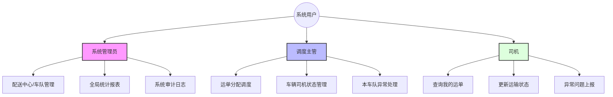
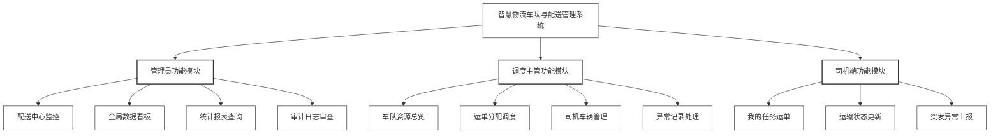

# 智慧物流车队与配送管理系统 - 数据库设计报告

## 0. 成员

| 学号 | 姓名 | 分工 | 贡献百分比 |
| :--- | :--- | :--- | :--- |
| 23320104 | 刘天翔 | 数据库设计、后端逻辑 | 33% |
| ... | ... | ... | 33% |
| ... | ... | ... | 33% |

---

## 1. 概念结构设计

### 1.1 实体集

根据题目所要求的需求，系统应该有一下的实体：

1.  **配送中心 (Distribution_Center)**
    物流网络的物理节点，负责管辖车队
    *   **属性**：
        *   `center_id` (中心编号): 唯一标识 [PK]
        *   `center_name` (中心名称): 如“华东一号仓”
        *   `address` (地址): 物理位置
2.  **车队 (Fleet)**
    负责管理车辆与司机
    *   **属性**：
        *   `fleet_id` (车队编号): 唯一标识 [PK]
        *   `fleet_name` (车队名称): 如“干线车队”
3.  **车辆 (Vehicle)**
    *   **属性**：
        *   `plate_number` (车牌号): 唯一标识 [PK]
        *   `max_weight` (最大载重): 吨
        *   `max_volume` (最大容积): 立方米
        *   `status` (车辆状态): 枚举值 (Idle, Loading, Busy, Maintenance, Exception)
4.  **司机 (Driver)**
    *   **属性**：
        *   `driver_id` (工号): 唯一标识 [PK]
        *   `name` (姓名)
        *   `license_level` (驾照等级): A1, A2, B1等
        *   `phone` (联系电话)
5.  **调度主管 (Dispatcher)**
    车队负责人，可以录入司机和车辆信息，分配运单，一个车队只有一个主管
    *   **属性**：
        *   `dispatcher_id` (工号/账号): 唯一标识 [PK]
        *   `name` (姓名)
        *   `password` (登录密码): 用于系统认证
6.  **运单 (Order)**
    *   **属性**：
        *   `Order_id` (运单号): 唯一标识 [PK]
        *   `cargo_weight` (货物重量)
        *   `cargo_volume` (货物体积)
        *   `destination` (目的地)
        *   `status` (运单状态): Pending, Loading, In-Transit, Delivered
        *   `start_time` (发车时间)
        *   `end_time` (签收时间)
7.  **异常记录 (Exception_Record)**
    运输、日常中的意外事件记录
    *   **属性**：
        *   `record_id` (记录ID): 唯一标识 [PK]
        *   `occur_time` (发生时间)
        *   `exception_type` (异常类型): 核心枚举值 (Transit_Exception-运输中异常, Idle_Exception-空闲时异常) —— 决定车辆恢复状态
        *   `specific_event` (具体事件): 如货物破损、车辆故障、严重延误、超速报警等
        *   `fine_amount` (罚款金额)
        *   `handle_status` (处理状态): Unprocessed, Processed
        *   `description` (描述)

1.  **审计日志 (History_Log)**
    记录关键数据变更的历史信息，日志系统，使用触发器自动生成
    *   **属性**：
        *   `log_id` (日志ID): 唯一标识 [PK]
        *   `table_name` (来源表名)
        *   `record_key` (记录主键)
        *   `column_name` (变更字段)
        *   `old_value` (旧值)
        *   `new_value` (新值)
        *   `change_time` (变更时间)
        *   `operator` (操作人)

### 1.2 关系集

1.  **辖属 (Center-Fleet)**: 1个配送中心下辖 N 个车队 (1:N)
2.  **拥有 (Fleet-Vehicle)**: 1个车队拥有 N 辆车 (1:N)
3.  **属于 (Fleet-Driver)**: 1个车队雇佣 N 名司机 (1:N)
4.  **管理 (Fleet-Dispatcher)**: 1个车队由 1 名主管管理 (1:1)
5.  **运输 (Vehicle-Order)**: 1辆车可以承运 N 个运单 (1:N)
6.  **驾驶 (Driver-Order)**: 1名司机负责 N 个运单 (1:N)
7.  **涉事车辆 (Exception-Vehicle)**: N 条异常关联 1 辆车 (N:1)
8.  **涉事司机 (Exception-Driver)**: N 条异常关联 1 名司机 (N:1)
9.  **审计异常记录 (History_Log-Exception)**: 多条日志记录关联到具体异常记录的具体记录 (N:1)
10. **审计司机 (History_Log-Driver)**: 多条日志记录关联到具体司机的具体记录 (N:1)


### 1.3 E-R 图


## 1.4 用户角色与权限

### 用户组织架构图

系统设计了三类用户角色：



### 系统功能模块图




## 2. 逻辑结构设计

### 2.1 关系模式

将上述 E-R 图转换为关系模式，下划线表示主键，双下划线表示外键。

1.  **Distribution_Center** (<u>center_id</u>, center_name, address)
2.  **Fleet** (<u>fleet_id</u>, fleet_name, <span style="text-decoration: underline double;">center_id</span>)
3.  **Dispatcher** (<u>dispatcher_id</u>, name, password, <span style="text-decoration: underline double;">fleet_id</span>)
4.  **Vehicle** (<u>plate_number</u>, <span style="text-decoration: underline double;">fleet_id</span>, max_weight, max_volume, status)
5.  **Driver** (<u>driver_id</u>, name, license_level, phone, <span style="text-decoration: underline double;">fleet_id</span>)
6.  **Order** (<u>Order_id</u>, cargo_weight, cargo_volume, destination, status, <span style="text-decoration: underline double;">vehicle_plate</span>, <span style="text-decoration: underline double;">driver_id</span>, start_time, end_time)
7.  **Exception_Record** (<u>record_id</u>, <span style="text-decoration: underline double;">vehicle_plate</span>, <span style="text-decoration: underline double;">driver_id</span>, occur_time, exception_type, specific_event, fine_amount, handle_status, description)
8.  **History_Log** (<u>log_id</u>, table_name, record_key, column_name, old_value, new_value, change_time, operator)

### 2.2 规范化分析

各个关系模式的函数依赖集如下：

1.  **配送中心表 (Distribution_Center)**
    $$
    F = \left\{
    \begin{aligned}
    \text{center\_id} \to \text{center\_name}, \text{address}
    \end{aligned}
    \right\}
    $$

2.  **车队表 (Fleet)**
    $$
    F = \left\{
    \begin{aligned}
    \text{fleet\_id} \to \text{fleet\_name}, \text{center\_id}
    \end{aligned}
    \right\}
    $$

3.  **调度主管表 (Dispatcher)**
    $$
    F = \left\{
    \begin{aligned}
    \text{dispatcher\_id} \to \text{name}, \text{password}, \text{fleet\_id}
    \end{aligned}
    \right\}
    $$

4.  **车辆表 (Vehicle)**
    $$
    F = \left\{
    \begin{aligned}
    \text{plate\_number} \to \text{fleet\_id}, \text{max\_weight}, \text{max\_volume}, \text{status}
    \end{aligned}
    \right\}
    $$

5.  **司机表 (Driver)**
    $$
    F = \left\{
    \begin{aligned}
    \text{driver\_id} \to \text{name}, \text{license\_level}, \text{phone}, \text{fleet\_id}
    \end{aligned}
    \right\}
    $$

6.  **运单表 (Order)**
    $$
    F = \left\{
    \begin{aligned}
    \text{Order\_id} \to \text{cargo\_weight}, \text{cargo\_volume}, \text{destination}, \text{status}, \\
    \text{start\_time}, \text{end\_time}, \text{vehicle\_plate}, \text{driver\_id}
    \end{aligned}
    \right\}
    $$

7.  **异常记录表 (Exception_Record)**
    $$
    F = \left\{
    \begin{aligned}
    \text{record\_id} \to \text{vehicle\_plate}, \text{driver\_id}, \text{occur\_time}, \text{exception\_type}, \\
    \text{specific\_event}, \text{fine\_amount}, \text{handle\_status}, \text{description}
    \end{aligned}
    \right\}
    $$

8.  **审计日志表 (History_Log)**
    $$
    F = \left\{
    \begin{aligned}
    \text{log\_id} \to \text{table\_name}, \text{record\_key}, \text{column\_name}, \text{old\_value}, \\
    \text{new\_value}, \text{change\_time}, \text{operator}
    \end{aligned}
    \right\}
    $$

可以看到上述所有设计关系模式均具有唯一的候选键（即主键）。每一个非平凡函数依赖的左部都包含了候选键，所有非主属性完全依赖于主键，且不存在非主属性对码的传递依赖。因此，**所有关系模式均符合 3NF 及 BCNF 设计规范**，有效消除了数据冗余和潜在的更新异常


## 3. 物理结构与高级对象设计

### 3.1 表结构定义

首先在SSMS中创建数据库 `FleetDistributionDB`，并使用以下 SQL 脚本创建各个表结构，定义主键、外键及完整性约束：

```sql
USE FleetDistributionDB;
GO

-- 1. Distribution_Center (center_id, center_name, address)
IF OBJECT_ID('Distribution_Center', 'U') IS NOT NULL DROP TABLE Distribution_Center;
CREATE TABLE Distribution_Center (
    center_id INT IDENTITY(1,1) PRIMARY KEY, -- 中心编号
    center_name NVARCHAR(50) NOT NULL,       -- 中心名称
    address NVARCHAR(100)                    -- 地址
);
GO

-- 2. Fleet (fleet_id, fleet_name, center_id)
IF OBJECT_ID('Fleet', 'U') IS NOT NULL DROP TABLE Fleet;
CREATE TABLE Fleet (
    fleet_id INT IDENTITY(1,1) PRIMARY KEY, -- 车队编号
    fleet_name NVARCHAR(50) NOT NULL,       -- 车队名称
    center_id INT NOT NULL,                 -- 所属中心
    CONSTRAINT FK_Fleet_Center FOREIGN KEY (center_id) REFERENCES Distribution_Center(center_id)
);
GO

-- 3. Dispatcher (dispatcher_id, name, password, fleet_id)
IF OBJECT_ID('Dispatcher', 'U') IS NOT NULL DROP TABLE Dispatcher;
CREATE TABLE Dispatcher (
    dispatcher_id NVARCHAR(20) PRIMARY KEY, -- 主管工号
    name NVARCHAR(50) NOT NULL,             -- 姓名
    password NVARCHAR(50) NOT NULL,         -- 密码
    fleet_id INT NOT NULL UNIQUE,           -- 所属车队 (1:1 关系)
    CONSTRAINT FK_Dispatcher_Fleet FOREIGN KEY (fleet_id) REFERENCES Fleet(fleet_id)
);
GO

-- 4. Vehicle (plate_number, fleet_id, max_weight, max_volume, status)
IF OBJECT_ID('Vehicle', 'U') IS NOT NULL DROP TABLE Vehicle;
CREATE TABLE Vehicle (
    plate_number NVARCHAR(20) PRIMARY KEY,      -- 车牌号
    fleet_id INT NOT NULL,                      -- 所属车队
    max_weight DECIMAL(10, 2) NOT NULL,         -- 最大载重
    max_volume DECIMAL(10, 2) NOT NULL,         -- 最大容积
    status NVARCHAR(20) NOT NULL DEFAULT 'Idle',-- 车辆状态
    
    -- 状态约束：空闲、运输中、维修中、异常 以及外键
    CONSTRAINT CK_Vehicle_Status CHECK (status IN ('Idle', 'Busy', 'Maintenance', 'Exception')),
    CONSTRAINT FK_Vehicle_Fleet FOREIGN KEY (fleet_id) REFERENCES Fleet(fleet_id)
);
GO

-- 5. Driver (driver_id, name, license_level, phone, fleet_id)
IF OBJECT_ID('Driver', 'U') IS NOT NULL DROP TABLE Driver;
CREATE TABLE Driver (
    driver_id NVARCHAR(20) PRIMARY KEY,  -- 司机工号
    name NVARCHAR(50) NOT NULL,          -- 姓名
    password NVARCHAR(50) NOT NULL DEFAULT '123456', -- 密码 
    license_level NVARCHAR(10) NOT NULL, -- 驾照等级
    phone NVARCHAR(20),                  -- 电话
    fleet_id INT NOT NULL,               -- 所属车队
    CONSTRAINT FK_Driver_Fleet FOREIGN KEY (fleet_id) REFERENCES Fleet(fleet_id)
);
GO

-- 6. Order (Order_id, cargo_weight, cargo_volume, destination, 
--          status, vehicle_plate, driver_id, start_time, end_time)
IF OBJECT_ID('[Order]', 'U') IS NOT NULL DROP TABLE [Order];
CREATE TABLE [Order] (
    Order_id NVARCHAR(20) PRIMARY KEY,    -- 运单号
    cargo_weight DECIMAL(10, 2) NOT NULL, -- 货物重量
    cargo_volume DECIMAL(10, 2) NOT NULL, -- 货物体积
    destination NVARCHAR(100) NOT NULL,   -- 目的地
    status NVARCHAR(20) NOT NULL DEFAULT 'Pending', -- 运单状态
    vehicle_plate NVARCHAR(20),           -- 承运车辆
    driver_id NVARCHAR(20),               -- 承运司机
    start_time DATETIME,                  -- 发车时间
    end_time DATETIME,                    -- 签收时间

    -- 完整性约束以及外键
    CONSTRAINT CK_Order_Status CHECK (status IN ('Pending', 'Loading', 'In-Transit', 'Delivered')),
    CONSTRAINT FK_Order_Vehicle FOREIGN KEY (vehicle_plate) REFERENCES Vehicle(plate_number),
    CONSTRAINT FK_Order_Driver FOREIGN KEY (driver_id) REFERENCES Driver(driver_id)
);
GO

-- 7. Exception_Record (record_id, vehicle_plate, driver_id, occur_time, 
--          exception_type, specific_event, fine_amount, handle_status, description)
IF OBJECT_ID('Exception_Record', 'U') IS NOT NULL DROP TABLE Exception_Record;
CREATE TABLE Exception_Record (
    record_id BIGINT IDENTITY(1,1) PRIMARY KEY,   -- 记录ID
    vehicle_plate NVARCHAR(20),                   -- 涉事车辆
    driver_id NVARCHAR(20),                       -- 涉事司机
    occur_time DATETIME DEFAULT GETDATE(),        -- 发生时间
    exception_type NVARCHAR(20) NOT NULL,         -- 异常类型
    specific_event NVARCHAR(50),                  -- 具体事件
    fine_amount DECIMAL(10, 2) DEFAULT 0,         -- 罚款金额
    handle_status NVARCHAR(20) DEFAULT 'Unprocessed', -- 处理状态
    description NVARCHAR(200),                    -- 描述

    -- 完整性约束以及外键
    CONSTRAINT CK_Exception_Type CHECK (exception_type IN ('Transit_Exception', 'Idle_Exception')),
    CONSTRAINT CK_Handle_Status CHECK (handle_status IN ('Unprocessed', 'Processed')),
    CONSTRAINT FK_Exception_Vehicle FOREIGN KEY (vehicle_plate) REFERENCES Vehicle(plate_number),
    CONSTRAINT FK_Exception_Driver FOREIGN KEY (driver_id) REFERENCES Driver(driver_id)
);
GO

-- 8. History_Log (log_id, table_name, record_key, column_name, old_value, new_value, change_time, operator)
IF OBJECT_ID('History_Log', 'U') IS NOT NULL DROP TABLE History_Log;
CREATE TABLE History_Log (
    log_id BIGINT IDENTITY(1,1) PRIMARY KEY, -- 日志ID
    table_name NVARCHAR(50) NOT NULL,        -- 表名
    record_key NVARCHAR(50) NOT NULL,        -- 记录主键值
    column_name NVARCHAR(50) NOT NULL,       -- 变更字段名
    old_value NVARCHAR(MAX),                 -- 旧值
    new_value NVARCHAR(MAX),                 -- 新值
    change_time DATETIME DEFAULT GETDATE(),  -- 变更时间
    operator NVARCHAR(50)                    -- 操作人
);
GO

```

### 3.2 触发器设计
为了实现业务自动化和数据完整性，系统设计了以下 6 个核心触发器：

1.  **TRG_Load_Check (安全校验)**
    *   **时机**: `Order` 插入/更新前。
    *   **逻辑**: 校验车辆剩余载重和容积是否足够（累加该车所有 Status 为 Loading/In-Transit 的运单）。若超载，抛出错误拦截操作。同时校验司机与车辆是否属于同一车队。
2.  **TRG_Auto_Status_Update (状态流转)**
    *   **时机**: `Order` 更新后。
    *   **逻辑**: 当运单状态变为 Delivered，检查车辆是否不再有正在进行的运单。若是，自动将车辆状态置为 Idle。
3.  **TRG_Exception_Flag (异常标记)**
    *   **时机**: `Exception_Record` 插入后。
    *   **逻辑**: 一旦录入异常，立即将关联车辆状态锁定为 Exception。
4.  **TRG_Exception_Recovery (智能恢复)**
    *   **时机**: `Exception_Record` 更新后（当 handled_status 变为 Processed）。
    *   **逻辑**: 检查车辆所有异常是否都已处理。若已全部处理，判断当前是否有未完成运单：有则恢复为 Busy，无则恢复为 Idle。
5.  **TRG_Exception_Audit (异常审计)**
    *   **时机**: `Exception_Record` 更新后。
    *   **逻辑**: 当处理状态变更时，向 History_Log 插入审计记录。
6.  **TRG_Driver_Update_Audit (司机信息审计)**
    *   **时机**: `Driver` 更新前。
    *   **逻辑**: 监控驾照等级等关键信息变更，记录旧值到 History_Log。

### 3.3 存储过程 (Stored Procedures)

1.  **SP_Calc_Fleet_Monthly_Report**: 计算指定车队、月份的总运单数、异常数、罚款总额。
2.  **SP_Get_Driver_Performance**: 查询指定司机在特定时间段内的绩效（完成单数）及异常明细。

### 3.4 视图 (Views)

1.  **VW_Weekly_Alert (本周异常警报)**: 展示最近 7 天发生过异常的车辆和司机，供仪表盘调用。
2.  **VW_Center_Resource_Status (资源汇总)**: 联表查询 Vehicle-Fleet-Distribution_Center，方便按配送中心层级查看车辆状态。

### 3.5 索引策略 (Indexes)

## 3.5 索引策略与性能优化 (Index Strategy & Performance Tuning)

### 3.5.1 策略制定原则
在本系统的数据库物理设计阶段，索引策略的制定并未盲目追求数量，而是基于**工作负载分析 (Workload Analysis)** 和 **读写平衡 (Read/Write Trade-off)** 原则。考虑到物流配送系统具有“高并发读（车辆调度、状态查询）”和“周期性写（运单生成、位置更新）”的 OLTP（在线事务处理）特性，我们制定了以下核心策略：

1.  **覆盖高频查询路径**：针对 `WHERE` 子句、`JOIN` 连接列以及 `ORDER BY` 排序字段建立索引。
2.  **利用覆盖索引 (Covering Index)**：通过 `INCLUDE` 包含非键列，消除回表操作 (Key Lookup/Bookmark Lookup)，降低 I/O 开销。
3.  **外键索引全覆盖**：SQL Server 不会自动为外键创建索引，必须手动建立以避免级联删除/更新时的全表锁，并优化连接性能。

### 3.5.2 详细索引设计与深度优化思路

#### 3.5.2.1 车辆资源调度优化 (Vehicle Resource Optimization)
* **索引名称**：`IDX_Vehicle_Status`
* **目标表**：`Vehicle`
* **定义**：`ON Vehicle(status) INCLUDE (max_weight, max_volume)`
* **深度优化逻辑**：
    * **场景痛点**：调度算法的核心逻辑是 `SELECT max_weight, max_volume FROM Vehicle WHERE status = 'Idle'`。若无索引，数据库引擎必须执行**全表扫描 (Clustered Index Scan)**，时间复杂度为 $O(N)$。
    * **解决方案**：建立非聚集索引。由于 `status` 列的**基数 (Cardinality)** 较小（只有 4 种状态），通常选择性不高。但通过将 `status` 作为索引键，并将业务所需的 `max_weight` 和 `max_volume` 作为**包含列 (Included Columns)**，我们构建了一个**覆盖索引**。
    * **性能收益**：查询引擎无需访问主表的数据页（Heap 或 Clustered Index），直接在非聚集索引的叶子节点即可获取所有所需数据。这消除了昂贵的随机 I/O 操作，将查询成本降至最低。

#### 3.5.2.2 时间维度报表优化 (Temporal Reporting Optimization)
* **索引名称**：`IDX_Order_Date`
* **目标表**：`[Order]`
* **定义**：`ON [Order](start_time, end_time)`
* **深度优化逻辑**：
    * **B-Tree 特性利用**：B-Tree 索引是有序存储的。针对 `start_time` 建立索引，使得 `WHERE start_time BETWEEN '2023-01-01' AND '2023-01-31'` 这样的范围查询可以转化为高效的**索引范围扫描 (Index Range Scan)**。
    * **组合索引顺序**：我们将 `start_time` 放在首位，因为报表通常以发车时间作为筛选基准。`end_time` 作为第二键值，有助于计算运输时长（Duration）时的排序和筛选。

#### 3.5.2.3 外键与关联查询优化 (Foreign Key & Join Optimization)
* **索引名称**：`IDX_Order_Vehicle` / `IDX_Exception_Driver`
* **目标表**：`[Order]`, `Exception_Record`
* **定义**：针对所有外键列（如 `vehicle_plate`, `driver_id`）建立非聚集索引。
* **深度优化逻辑**：
    * **避免 Hash Join**：当 `Driver` 表（小表）与 `Exception_Record` 表（大表）连接时，如果外键列 `driver_id` 没有索引，优化器往往会选择 **Hash Join**，需要消耗大量内存构建哈希表。
    * **促进 Nested Loop Join**：建立索引后，优化器更倾向于使用 **Nested Loop Join**，利用索引快速查找匹配行，这对提取单条记录（如“查询司机王某的所有违规”）极其高效。
    * **聚合函数加速**：在 `[Order]` 表的 `vehicle_plate` 索引中，我们额外 `INCLUDE (cargo_weight)`。这样在触发器检查超载时执行 `SUM(cargo_weight)`，数据库只需扫描轻量级的索引页，而无需读取宽大的数据行。

### 3.5.3 索引代价与维护 (Cost & Maintenance)

在享受查询加速的同时，我们也在设计中考量了索引带来的代价：

* **写操作惩罚 (Write Penalty)**：每当 `[Order]` 表插入新记录时，数据库不仅要写入数据页，还要更新 `IDX_Order_Date` 和 `IDX_Order_Vehicle` 的 B-Tree 结构。
* **存储空间**：非聚集索引需要额外的磁盘空间。为此，我们避免了 `SELECT *` 的滥用，仅在 `INCLUDE` 中包含必要的列，以控制索引叶子节点的大小。
* **碎片管理 (Fragmentation)**：由于 `Order_id` 是字符串且可能非顺序插入，易导致页分裂。我们在生产环境建议设置合理的 `FILLFACTOR` (如 90%) 以预留空间减少页分裂。

> 说明：`Dispatcher` 表的登录查询依赖主键 `dispatcher_id`，系统已自动为主键建立聚集索引，因此未额外增加重复索引以避免维护成本。

---

---

## 4. 系统实现与测试

### 4.1 开发环境
*   **Operating System**: Windows
*   **Database**: Microsoft SQL Server 2019 
*   **IDE**: SQL Server Management Studio (SSMS)
*   **编程语言**: Python 3.10
*   **Web Framework**: Django 4.2
*   **前端框架**: Bootstrap 5

### 4.2 关键功能展示
*(此处插入关键功能的运行截图)*
*   图1：超载触发器拦截报错截图。
*   图2：运单分配与车辆状态自动变更截图。
*   图3：异常录入与车辆锁定截图。


#### 4.2.n 索引性能验证与分析 (Index Performance Verification)

##### 4.2.n.1 测试环境与方法
为了客观验证索引策略的有效性，本次实验采用“控制变量法”进行性能对比测试。
* **测试数据量**：在 `[Order]` 表和 `Exception_Record` 表分别生成 **100,000 条** 模拟业务数据。
* **测试指标**：主要关注 **逻辑读取次数 (Logical Reads)**。该指标反映了数据库引擎从缓存或磁盘读取数据页的数量，是衡量查询 I/O 开销的核心指标，受系统负载波动影响较小，比“执行时间”更具参考价值。
* **测试工具**：使用 SQL Server 的 `SET STATISTICS IO ON` 和 `SET STATISTICS TIME ON` 捕获性能数据。

#### 4.2.n.2 详细性能对比分析

根据实验日志，针对四类典型高频查询场景的性能对比数据如下：

##### 1. 时间范围查询 (Range Scan Optimization)
* **业务场景**：查询过去 24 小时内的所有运单。
    ```sql
    SELECT ... FROM [Order] WHERE start_time >= DATEADD(DAY, -1, GETDATE()) ...
    ```
* **性能数据**：
    * [cite_start]**无索引**：逻辑读取 **2005** 页 [cite: 2]。
    * [cite_start]**有索引** (`IDX_Order_Date`)：逻辑读取 **6** 页 [cite: 5]。
* **分析**：
    性能提升幅度达到 **99.7%**。未建立索引时，数据库执行全表扫描 (Clustered Index Scan)，必须遍历 10 万行数据。建立 B-Tree 索引后，引擎通过索引范围扫描 (Index Range Scan) 直接定位到时间段的起始页，仅读取相关数据页，极大地降低了 I/O 成本。

##### 2. 多条件精确查找 (Multi-Column Lookup)
* **业务场景**：查询特定司机（DR001）在过去 24 小时已送达的运单。
    ```sql
    SELECT ... FROM [Order] WHERE driver_id = 'DR001' AND status = 'Delivered' ...
    ```
* **性能数据**：
    * [cite_start]**无索引**：逻辑读取 **2005** 页 [cite: 3]。
    * [cite_start]**有索引** (`IDX_Order_Driver` / 复合索引)：逻辑读取 **3** 页 [cite: 6]。
* **分析**：
    逻辑读取数从 2005 降至 **3**，这是最显著的优化案例。利用非聚集索引的高选择性，数据库避免了全表扫描，通过 Index Seek 瞬间定位到目标行，实现了毫秒级响应。

##### 3. 排序与过滤优化 (Sort & Filter Optimization)
* **业务场景**：查询某司机的异常记录并按时间倒序排列。
    ```sql
    SELECT ... FROM Exception_Record WHERE driver_id = 'DR001' ORDER BY occur_time DESC
    ```
* **性能数据**：
    * [cite_start]**无索引**：逻辑读取 **1954** 页，CPU 时间 **15 ms** [cite: 2]。
    * [cite_start]**有索引** (`IDX_Exception_Driver`)：逻辑读取 **62** 页，CPU 时间 **0 ms** [cite: 6]。
* **分析**：
    I/O 开销降低 **96.8%**，且 CPU 占用降至 0ms。无索引时，数据库需全表扫描并进行内存排序 (Sort Operator)。有索引后，数据本身在索引树中已按键值有序存储（或利用索引辅助排序），消除了昂贵的排序计算开销。

##### 4. 状态筛选优化 (Status Filtering)
* **业务场景**：查找所有“待处理 (Pending)”状态的运单。
    ```sql
    SELECT ... FROM [Order] WHERE status = 'Pending'
    ```
* **性能数据**：
    * [cite_start]**无索引**：逻辑读取 **2005** 页 [cite: 4]。
    * [cite_start]**有索引** (`IDX_Order_Status`)：逻辑读取 **157** 页 [cite: 7]。
* **分析**：
    读取次数降低约 **92%**。由于历史订单多为 "Delivered"，"Pending" 状态的数据占比较小。索引使得引擎可以跳过绝大多数历史数据，仅精准扫描活跃订单部分。

### 4.2.n.3 性能可视化

下图展示了各场景在优化前后逻辑读取次数（Logical Reads）的对比，Y轴采用对数坐标以突显数量级差异。


### 4.2.n.4 实验结论

1.  **I/O 吞吐量质变**：在高频的大表查询中，合理的索引策略将 I/O 读取量降低了 **2-3 个数量级**。这直接意味着生产环境下的磁盘负载将减少 90% 以上。
2.  **CPU 资源释放**：索引通过消除显式的排序操作（Sort）和大量的页扫描，大幅节省了 CPU 计算资源，这对提高系统的并发处理能力至关重要。
3.  **策略有效性**：实验证明，针对 `start_time`（范围）、`driver_id`（高频外键）和 `status`（状态流转）建立的索引策略是完全正确的，精准解决了高频查询路径上的性能瓶颈。


### 4.3 技术难点与解决
*   **难点**: 如何在并发环境下准确计算车辆剩余载重，防止“超卖”。
*   **解决**: 使用数据库事务（Transaction）配合触发器内的计算逻辑，确保在分配运单时读取到的 CurrentSum 是即时准确的。

### 4.4 前端技术选型与关键代码

**技术选型与逻辑**

1. **Django 模板（Server-Side Rendering）**  
   - **选择原因**：系统以“表单录入 + 列表展示 + 状态更新”为主，页面交互偏管理后台场景，服务端渲染能够直接复用后端权限与数据查询逻辑，减少前后端分离带来的接口与状态同步成本。  
   - **技术逻辑**：在 `views.py` 中完成数据聚合、权限校验与异常处理，模板只负责展示与少量交互；同时借助 Django 的 `CSRF` 保护与会话机制保证安全性与一致性。  
   - **适配场景**：运单分配、异常处理、司机/车辆管理等页面都是强“数据表 + 表单”的后台场景，SSR 更易维护。

2. **Bootstrap 5**  
   - **选择原因**：提供稳定的响应式栅格、表格、表单、导航栏等组件，能快速搭建统一风格的管理界面。  
   - **技术逻辑**：以 `container`/`row`/`col` 布局为主，结合组件类（如 `card`、`table`、`navbar`、`badge`、`modal`）形成模块化页面结构，保证在不同屏幕尺寸下良好的可读性。

3. **模板继承 + 组件化组织**  
   - **选择原因**：多个页面需要共享导航栏、消息提示、脚本与样式，模板继承可减少重复代码。  
   - **技术逻辑**：以 `base.html` 作为母版，页面通过 `` 与 `` 渲染主体，保证全站结构一致。

4. **轻量 JavaScript 交互**  
   - **选择原因**：需求以表单与表格交互为主，少量 JS 即可满足“快速选中”“状态更新”等操作，无需引入复杂前端框架。  
   - **技术逻辑**：在模板中内联简单函数，完成小范围 DOM 操作，避免过度工程化。

5. **自定义样式（app.css）**  
   - **选择原因**：在保持 Bootstrap 结构的同时加入品牌视觉（背景、阴影、动画等），增强可读性与交互体验。  
   - **技术逻辑**：通过 `static` 静态资源加载，并对卡片、表格、按钮等进行轻量化覆盖，形成统一视觉风格。

**页面结构与交互策略**

- **角色分层**：系统区分管理员、调度主管、司机三类身份。模板根据 `request.session.role` 动态展示菜单项与入口，避免权限混用。  
- **统一布局**：所有页面共享导航栏、全局提示与内容容器，核心信息均以卡片与表格呈现，降低学习成本。  
- **数据展示**：统计类页面采用“数字卡片 + 汇总表 + 异常列表”组合，突出关键指标；详情类页面使用分组卡片/表格，保证信息清晰。  
- **表单流程**：新增/编辑/删除统一采用 `form` 与 `CSRF` 防护，并使用模态框与确认弹窗减少误操作。  
- **反馈机制**：系统统一使用 Django Messages 输出成功/失败提示，结合 Bootstrap `alert` 样式增强可见性。

**关键代码示例**

1. **统一布局 + 角色导航（`base.html`）**  
   通过模板继承与会话角色控制菜单项，实现管理员/调度/司机的差异化导航。

```html

<link
    href="https://cdn.jsdelivr.net/npm/bootstrap@5.3.3/dist/css/bootstrap.min.css"
    rel="stylesheet"
>
<link rel="stylesheet" href=""><!-- 引入自定义样式 -->

<nav class="navbar navbar-expand-lg navbar-dark bg-dark mynav shadow-sm">
    <div class="container">
        <a class="navbar-brand" href="">智能物流车队与配送管理系统</a>
        <div class="collapse navbar-collapse" id="navbarNav">
            <div class="navbar-nav">
                <!-- 根据会话角色切换菜单 -->
                
                    <!-- 调度主管功能入口 -->
                    <a class="nav-link" href="">车辆管理</a>
                    <a class="nav-link" href="">运单分配</a>
                
                    <!-- 司机入口 -->
                    <a class="nav-link" href="">我的信息</a>
                
            </div>
        </div>
    </div>
</nav>
```

2. **全局消息提示（`base.html`）**  
   统一反馈成功/失败信息，用户无需跳转即可确认操作结果。

```html

    
        <div class="alert alert-{{ message.tags }} alert-dismissible fade show" role="alert">
            {{ message }} <!-- Django Messages 输出 -->
            <button type="button" class="btn-close" data-bs-dismiss="alert" aria-label="Close"></button>
        </div>
    

```

3. **统计卡片 + 数据汇总（`dashboard.html`）**  
   通过卡片显示关键指标，并用表格汇总车辆状态分布，突出“总览”信息。

```html
<div class="row g-3 mb-4">
    <div class="col-md-3">
        <div class="card border-0 shadow-sm hover-card">
            <div class="card-body">
                <p class="text-muted mb-1">车辆总数</p>
                <h4 class="mb-0">{{ stats.total_vehicles }}</h4> <!-- 后端统计值 -->
            </div>
        </div>
    </div>
</div>

<table class="table table-sm table-striped mb-0">
    <thead class="table-light">
        <tr>
            <th>状态</th>
            <th class="text-end">数量</th>
        </tr>
    </thead>
    <tbody>
        
        <tr>
            <td>{{ row.label }}</td>
            <td class="text-end">{{ row.total }}</td>
        </tr>
        
        <tr>
            <td colspan="2" class="text-muted text-center">暂无数据</td>
        </tr>
        
    </tbody>
</table>
```

4. **运单分配表单 + 列表联动（`orders.html`）**  
   以 Bootstrap 表单组件完成分配流程，并用 JS 一键填充运单号，减少人工输入。

```html
<form method="post">
    <!-- CSRF 防护 -->
    <label class="form-label">待分配运单</label>
    <select class="form-select" name="order_id" id="select-order-id" required>
        
            <option value="{{ order.order_id }}">{{ order.order_id }} - {{ order.destination }}</option>
        
    </select>
    <button class="btn btn-success w-100" type="submit">提交分配</button>
</form>

<script>
    function selectOrder(orderId) {
        const select = document.getElementById('select-order-id');
        if (select) {
            select.value = orderId;              // 选中指定运单
            select.style.backgroundColor = "#e8f0fe"; // 轻量视觉提示
            setTimeout(() => {
                select.style.backgroundColor = "";
            }, 300);
        }
    }
</script>
```

5. **司机管理：筛选 + 编辑弹窗（`drivers.html`）**  
   支持按车队筛选司机，编辑动作用模态框完成，减少页面跳转。

```html
<form class="row g-3 mb-3" method="get">
    <div class="col-md-6">
        <label class="form-label">车队</label>
        <select class="form-select" name="fleet_id">
            <option value="">全部车队</option>
            
                <option value="{{ fleet.fleet_id }}" selected>
                    {{ fleet.fleet_name }}
                </option>
            
        </select>
    </div>
    <div class="col-md-6 d-flex align-items-end">
        <button class="btn btn-primary w-100" type="submit">筛选</button>
    </div>
</form>

<button class="btn btn-sm btn-outline-primary" data-bs-toggle="modal" data-bs-target="#editDriverModal{{ driver.driver_id|slugify }}">
    <i class="fa fa-edit"></i> 编辑 <!-- 使用 Bootstrap Modal -->
</button>
```

6. **异常管理：状态徽标与处理动作（`exceptions.html`）**  
   通过徽标颜色强调处理状态，并提供“确认处理”按钮。

```html
<td>
    
        <span class="badge bg-danger">未处理</span>
    
        <span class="badge bg-success">已处理</span>
    
</td>
<td class="text-center">
    
    <form method="post" onsubmit="return confirm('确认标记为已处理？');">
        
        <input type="hidden" name="action" value="resolve">
        <input type="hidden" name="record_id" value="{{ record.record_id }}">
        <button class="btn btn-sm btn-outline-success py-0" type="submit">处理</button>
    </form>
    
        -
    
</td>
```

7. **模板渲染的数据准备（`views.py`）**  
   视图层先做统计与聚合，再交给模板渲染，保证页面逻辑清晰。

```python
status_summary = {key: 0 for key in VEHICLE_STATUS_LABELS}
for row in vehicle_queryset.values("status").annotate(total=Count("status")):
    status_summary[row["status"]] = row["total"]  # 统计各状态车辆数量

stats = {
    "total_vehicles": sum(status_summary.values()),
    "total_drivers": driver_queryset.count(),
    "pending_orders": Order.objects.filter(status="Pending").count(),
    "unprocessed_exceptions": exception_queryset.filter(handle_status="Unprocessed").count(),
}

return render(
    request,
    "managersystem/dashboard.html",
    {
        "status_summary": [
            {"code": code, "label": label, "total": status_summary.get(code, 0)}
            for code, label in VEHICLE_STATUS_LABELS.items()
        ],
        "stats": stats,
    },
)
```

8. **自定义视觉强化（`static/managersystem/css/app.css`）**  
   通过背景、动画与卡片阴影强化“管理后台”的层级感与可读性。

```css
body {
    background-image: url("../images/background.jpg"); /* 背景图营造系统氛围 */
    background-attachment: fixed;
}

.mynav .nav-link {
    color: rgba(255, 255, 255, 0.85); /* 提升暗色导航可读性 */
    transition: color 0.2s ease, transform 0.2s ease;
}

.page-animate {
    animation: fadeInUp 0.6s ease; /* 页面进入动效 */
}

.card {
    border-radius: 12px;            /* 卡片圆角增强层次 */
    box-shadow: 0 12px 30px rgba(15, 23, 42, 0.08);
}

.hover-card:hover {
    transform: translateY(-4px);    /* 轻量悬浮反馈 */
}
```

---

## 5. 总结

本次课程设计完成了一个符合 3NF 标准的物流配送管理系统数据库。通过引入触发器实现了业务逻辑的数据库端自动化（如状态流转、超载校验），大大减轻了应用层的负担，保证了数据的强一致性。存储过程和视图的使用则提高了统计报表的查询效率。

### 5.2 数据库效率优化的思考与总结

本系统的性能优化并非只依赖索引，而是贯穿于“建模—结构设计—逻辑实现—查询组织”的全过程。优化思路的核心是：**减少冗余、降低 I/O、缩短路径、让查询有路可走**。具体体现在以下几个层面：

1. **结构层（Schema）优化：从源头减少无效数据与 I/O**  
   结构层首先坚持 3NF，将配送中心、车队、车辆、司机、运单、异常、审计等分表存储，避免在运单中重复写入司机/车队等信息导致更新异常；主键与外键统一规范，主键保证行定位与聚簇组织，外键让 JOIN 路径明确并利于优化器估算，同时用唯一约束保证一对一关系（如车队-主管）。字段类型按业务精确控制（ID 用 INT/BIGINT、重量/金额用 DECIMAL、时间用 DATETIME），配合 NOT NULL、DEFAULT、CHECK/枚举状态，减少无效值与页空间浪费，并避免在核心表中堆积大文本或派生字段，使后续索引与统计更高效。

2. **业务逻辑层（Triggers）优化：减少应用层重复计算**  
   业务逻辑层把校验与状态流转前置到触发器中，运单分配时仅统计车辆未完成运单的重量/体积，避免应用层多次查询与重复 I/O；运单完成后自动回写车辆状态，异常发生/处理触发状态变更与审计记录，形成闭环。触发器实现尽量采用集合运算与最小化扫描的写法，并区分 Insert/Update 场景避免重复累计；同时依托数据库事务与隔离级别保证并发一致性，使“超载校验、权限限制、状态恢复”在同一事务内完成，从而减少跨层调用与错误回滚成本。

3. **查询组织层（Procedures & Views）优化：固定高频统计路径**  
   查询组织层通过视图与存储过程固化高频统计路径。视图（如本周异常警报、资源汇总）把多表 JOIN 与筛选封装，前端仅需 SELECT 即可获得结果，避免重复拼装 SQL；存储过程集中计算月报与司机绩效，参数化执行减少计划重新编译并统一口径，同时减少应用层循环统计的 I/O。报表型查询统一由数据库侧完成聚合与排序，缩短网络传输并降低前端解析成本；当统计口径需要调整时只需改动视图/过程即可，全局一致性更强。

4. **索引层优化：为高频查询铺路**  
   索引层以业务高频与高选择性条件为核心：空闲车辆筛选、运单时间范围、司机异常追溯等建立索引，并按“等值在前、范围在后”的顺序设计复合键；对统计类查询加入 INCLUDE 列形成覆盖索引，减少回表与逻辑读。对于主键已覆盖的列不再重复建索引，避免维护成本；对低选择性或写入频繁字段谨慎建索引，以免影响插入/更新性能。索引效果通过 STATISTICS IO/TIME 对比验证，将原有全表扫描转为索引定位/范围扫描，并显著降低逻辑读取。

5. **数据生命周期与可扩展性考虑**  
   数据生命周期与扩展性方面，将审计日志、历史异常视作冷数据独立存放，避免拖慢核心业务表；对运单等增长最快的表预留按时间分区或归档策略，便于历史数据迁移与统计。前端分页与筛选减少一次性拉取，降低网络与数据库压力；运营期可设置定期清理或归档任务，控制热表体量。结合定期备份与索引维护（重建/更新统计），并监控慢查询与热点表，确保数据规模增长后仍能保持稳定性能与可维护性。

总结来看，本系统的性能优化是一套“从设计到落地”的综合策略：**规范化减少冗余、触发器保证一致性、视图/存储过程缩短查询路径、索引提升高频访问效率**。这种“结构 + 逻辑 + 查询 + 索引”的组合，确保在数据量增长时仍能保持稳定的响应与可维护性。

---

## 6. 附录

### 6.1 主要 SQL 脚本
*(附上建表、触发器、存储过程的完整 SQL 代码)*

### 6.2 演示视频链接
*(视频链接)*
